# Pix2Pix: Denoising and Super Resolution (x4)

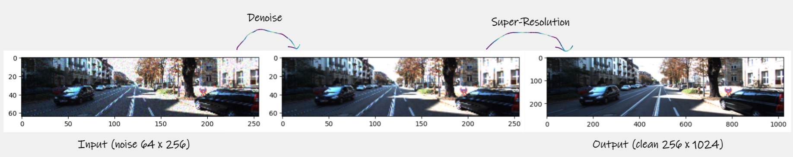

# Overall about Pix2Pix

##  Image-to-Image Translation with Conditional Adversarial Networks

**Link paper:** [Image-to-Image Translation with Conditional Adversarial Networks](https://arxiv.org/abs/1611.07004)

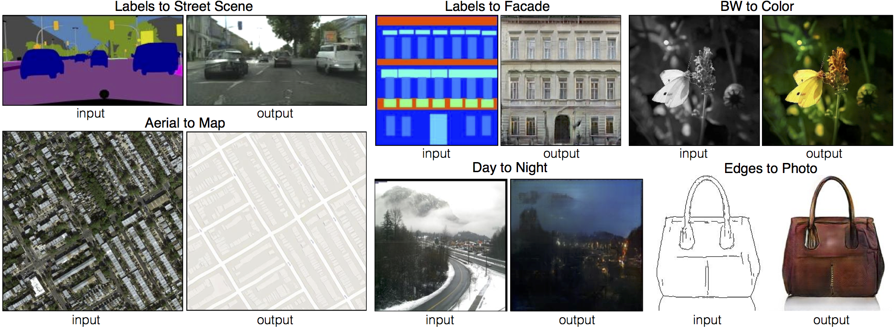

**Pix2Pix GAN**  paper was published back in 2016 by Phillip Isola, Jun-Yan Zhu, Tinghui Zhou, Alexei A. Efros. It was later revised in 2018.
**Pix2Pix** is a deep learning model that aims to learn a mapping between an input image and an output image using a conditional generative adversarial network (cGAN)

## Conditional GAN

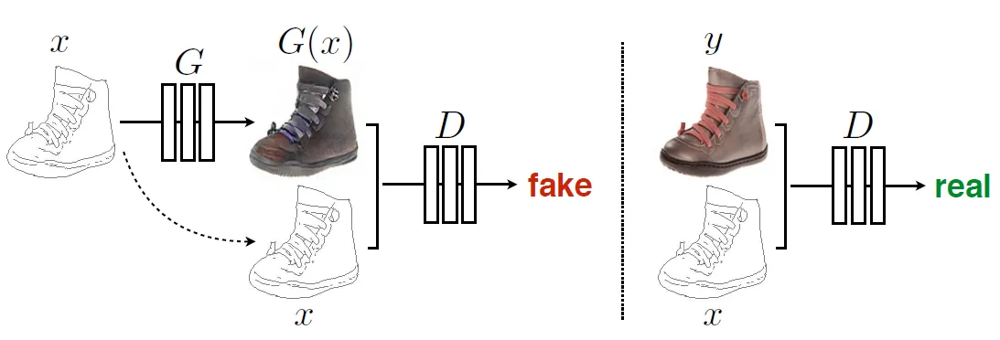

- The above shows an example of training a conditional GAN to map edges→photo.
- The discriminator, D, learns to classify between fake (synthesized by the generator) and real {edge, photo} tuples.
- The generator, G, learns to fool the discriminator.
- Unlike an unconditional GAN, both the generator and discriminator observe the input edge map.

  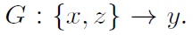

**That is, conditional GANs learn a mapping from observed image x and random noise vector z, to y.**

## Conditional-Adversarial Loss

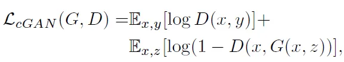

## L1 Loss

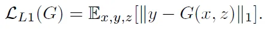

## Final Loss

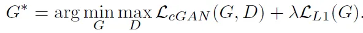

## Pix2Pix: Network Architectures

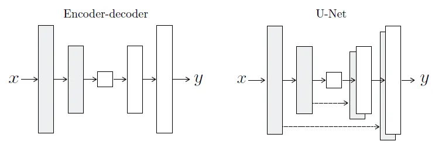

- Both generator and discriminator use modules of the form convolution-BatchNorm-ReLu.

## PatchGAN

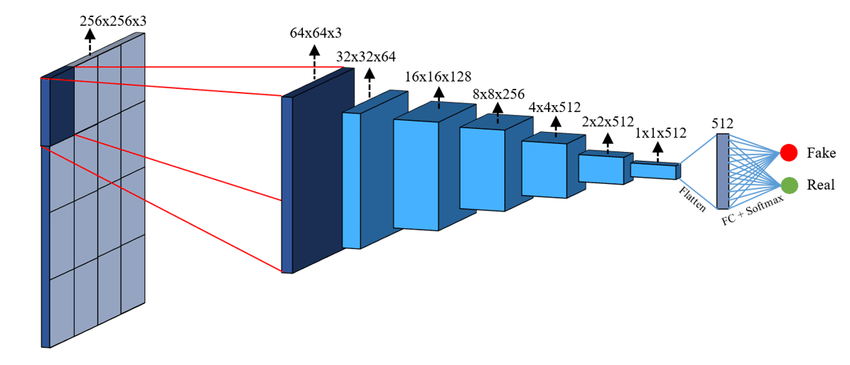

## Applications

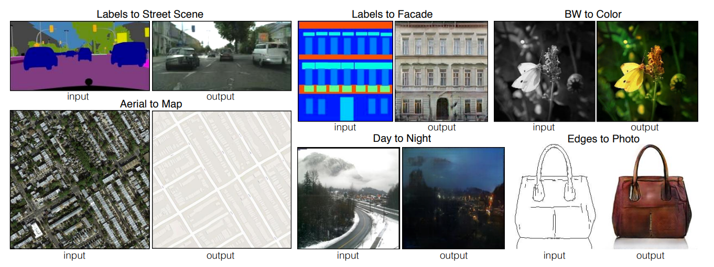

There are many applications of a pix2pix network. These include the following:
- To convert pixel level segmentation into real images
- To convert day images into night images and vice versa
- To convert satellite areal images into map images
- To convert sketches into photos
- To convert black and white images into colored images and vice versa

## Limitations

Pix2Pix is a supervised learning algorithm. This means that it requires a dataset of paired examples. This is a major limitation as it is not always possible to obtain paired examples.

# Results

Some results after 120 epochs (run Pix2Pix_Denoising_and_Super_Resolution.ipynb on colab)

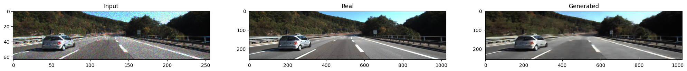
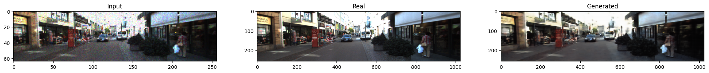
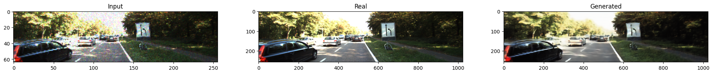
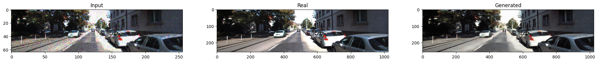
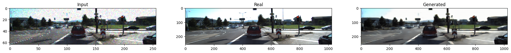

**Many of the images created are quite good quality, besides a few images are not the same as the original and low quality.**

**Weight:** [Generator](https://drive.google.com/file/d/1-8iTwKFJH9Dkkc_oymJlvnWiOqZiZ5fB/view?usp=sharing)

# References
https://arxiv.org/abs/1611.07004

https://sh-tsang.medium.com/review-pix2pix-image-to-image-translation-with-conditional-adversarial-networks-gan-ac85d8ecead2

https://www.oreilly.com/library/view/generative-adversarial-networks/9781789136678/6a7a1669-f77e-4eb0-8121-77d30a7a24e3.xhtml

https://www.tensorflow.org/tutorials/generative/pix2pix#build_the_discriminator